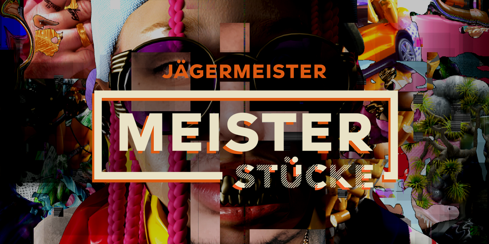

## WELCOME TO <MEISTERSTÜCKE>
### URBAN ART MEETS A.I.

For this project, the Instagram accounts of 12 Urban Artists were used as a database.

Each artist was finally portrayed through their own art through Artificial Intelligence.

_<MEISTERSTÜCKE> was initiated and enabled by Jägermeister._

By making this code Open Source, we hope we can inspire makers everywhere to create new, exciting projects of their own.

In other words: Do what’s never been done so people can feel what’s never been felt. Be the Meister.

## Features
|     Feature    |  Supported |
|----------------|:----------:|
| Filters        |      ✅    |
| Painting       |      ✅    |
| Face detection |      ✅    |
| AI Collage     |      ❌    |
|                |            |
|                |            |
|                |            |

## Download

If you are using Windows you can download and try the project yourself.

* [Download for Windows](https://github.com/WaltzBinaire/LayerDev/releases/tag/v2.6n)

## Build

If you want to build the program, you will need to compile it with [openFrameworks](https://openframeworks.cc/). Check out [this](https://openframeworks.cc/learning/) tutorial for more information.

## Shortcuts

| Key | Function |
|-----|----------|
|     |          |
|     |          |
|     |          |
|     |          |
|     |          |
|     |          |
|     |          |gi